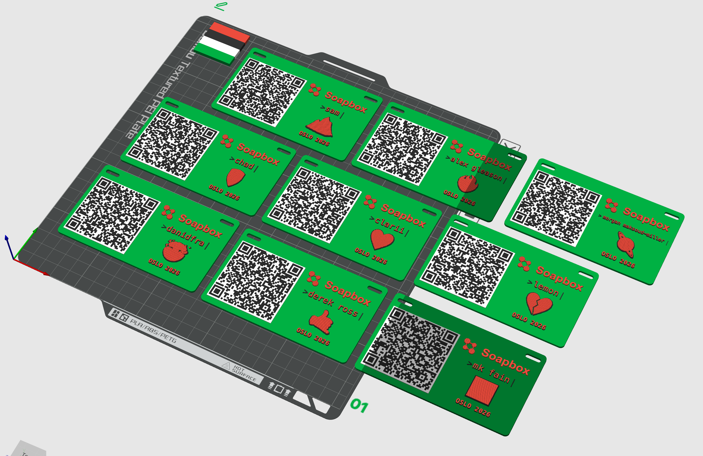

# Soapbox Namebadges

Generate printable `.3mf` conference badges for Bambu Studio + AMS.



## Quick Start

```bash
pip install -r requirements.txt
python generate_badge_2026_oslo.py --members-file team_members.json --member "Sam"
```

Output is written to `output/namebadges/`.

## Batch Generate

```bash
python generate_badge_2026_oslo.py --members-file team_members.json --only-oslo
```

## Conference Script Pattern

Create one primary script per conference and evolve that script over time.

- Naming convention: `generate_badge_<year>_<conference>.py` so files stay ordered
- Current script: `generate_badge_2026_oslo.py`
- Future conferences: copy that file to a new name, for example `generate_badge_2027_tokyo.py`

## Conference Versions

| Conference | Script | Background | QR Back | Logo / Primary | QR Fore / Accent |
| --- | --- | --- | --- | --- | --- |
| Oslo 2026 | `generate_badge_2026_oslo.py` | T-purple | White | Orange | Gurple |
| Czech 2026 (Praha) | `generate_badge_2026_praha.py` | T-blue | White | Orange | Green |
| Kenya (planned) | `generate_badge_<year>_kenya.py` | Wood | Orange | Red | Green |

## Files

- `generate_badge_2026_oslo.py` - primary Oslo 2026 badge generator
- `generate_badge_2026_praha.py` - Praha variant scaffold copied from Oslo
- `badge_qr_mesh.py` - shared QR mesh utility used by conference generators
- `team_members.json` - input data for batch generation
